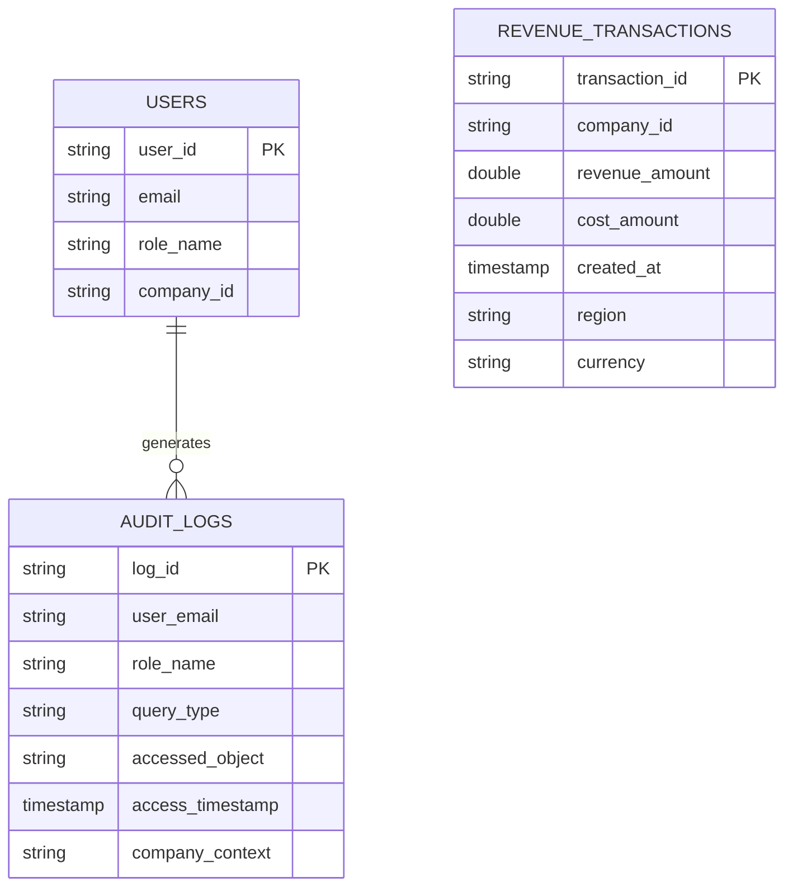

# STAGE 1 — ER DIAGRAM (Logical Overview)

We have **3 core tables** and derived views. Only tables are shown in ER (views are derived, not entities).

---

## 🧱 ENTITIES

1. **`revenue_transactions`** (Fact Table – Financial Data)
2. **`users`** (Role Mapping Table)
3. **`audit_logs`** (Query Tracking Table)

---

## 🔗 RELATIONSHIPS

### A. `users` → `revenue_transactions`
Indirect relationship via: `company_id`. Finance users are restricted to their assigned company.

### B. `users` → `audit_logs`
Direct relationship: `users.email = audit_logs.user_email`. One user → many audit logs.

### C. `revenue_transactions` → `revenue_yearly_view` → `secure_revenue_yearly`
Derived relationship (view pipeline).

---

## 📐 ER DIAGRAM (Text Layout)

```text
                ┌──────────────────────────────┐
                │            users             │
                ├──────────────────────────────┤
                │ PK user_id                  │
                │ email                       │
                │ role_name                   │
                │ company_id                  │
                └──────────────┬──────────────┘
                               │
                               │ 1
                               │
                               │ N
                ┌──────────────▼──────────────┐
                │         audit_logs          │
                ├──────────────────────────────┤
                │ PK log_id                  │
                │ user_email (FK logical)    │
                │ role_name                  │
                │ query_type                 │
                │ accessed_object            │
                │ access_timestamp           │
                │ company_context            │
                └──────────────────────────────┘


                ┌──────────────────────────────┐
                │    revenue_transactions      │
                ├──────────────────────────────┤
                │ PK transaction_id           │
                │ company_id                  │
                │ revenue_amount              │
                │ cost_amount                 │
                │ created_at                  │
                │ region                      │
                │ currency                    │
                └──────────────────────────────┘
```

---

## 🔄 Derived Flow (View Layer – Not Physical ER)

```text
revenue_transactions
        ↓
revenue_yearly_view
        ↓
secure_revenue_yearly
        ↓
API / AI
```
*(Same flow for quarterly)*

---

## 🧩 Mermaid ER Diagram



---

## 🔐 Important Design Notes
* No direct FK between `users` and `revenue_transactions`.
* Relationship enforced via secure views (logical multi-tenant join).
* `audit_logs` tracks execution events.
* Aggregation views are derived (not entities).

## 🏗 Architecture Type
This is a **Fact + Governance + Audit Pattern**, typically used in enterprise financial systems.
